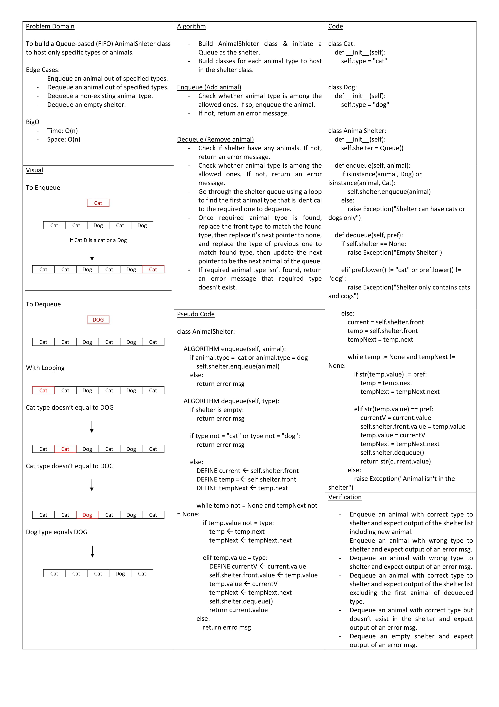

# Stacks and Queues Animal Shelter

To build a Queue-based (FIFO) AnimalShleter class to host only specific types of animals.

## Approach & Efficiency

### Initially

- Build AnimalShleter class & initiate the shelter as a Queue.
- Build classes for each animal type to host in the shelter.

### Enqueue (Add animal)

- Check whether animal type is among the allowed ones. If so, enqueue the animal.
- If not, return an error message.

### Dequeue (Remove animal)

- Check if shelter have any animals. If not, return an error message.
- Check whether animal type is among the allowed ones. If not, return an error message.
- Go through the shelter queue using a loop to find the first animal type that is identical to the required one to dequeue.
- Once required animal type is found, replace the front type to match the found type, then replace it’s next pointer to none, and replace the type of previous one to match found type, then update the next pointer to be the next animal of the queue.
- If required animal type isn’t found, return an error message that required type doesn’t exist.

Big O
Time: O(n)
Space: O(n)
