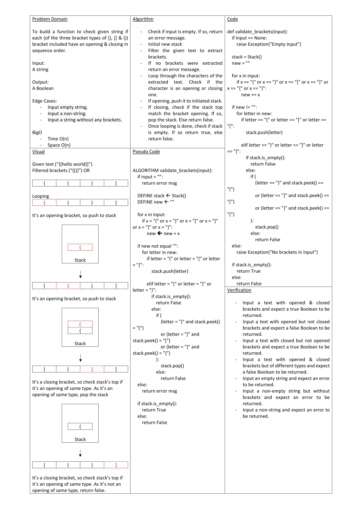

# Stacks and Queues Brackets

To build a function to check given string if each (of the three bracket types of {}, [] & ()) bracket included have an opening & closing in sequence order.

## Approach & Efficiency

- Check if input is empty. If so, return an error message.
- Initial new stack
- Filter the given text to extract brackets.
- If no brackets were extracted return an error message.
- Loop through the characters of the extracted text. Check if the character is an opening or closing one.
- If opening, push it to initiated stack.
- If closing, check if the stack top match the bracket opening. If so, pop the stack. Else return false.
- Once looping is done, check if stack is empty. If so return true, else return false.

Big O
Time: O(n)
Space: O(n)
