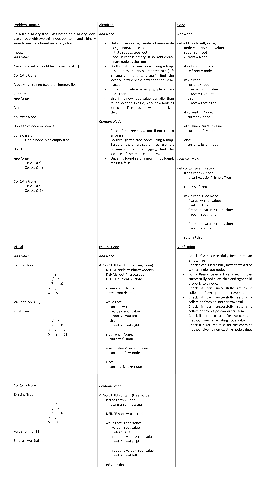

# Tree Fizz Buzz

To go through a k-ary tree nodes n replace the values by strings

## Whiteboard Process

## Approach & Efficiency

Through a recurssive function, the approach is to visit each node n check its value, then check the node children's values.

Big O:
Time: O(1)
Space: O(1)

## Solution

Text
