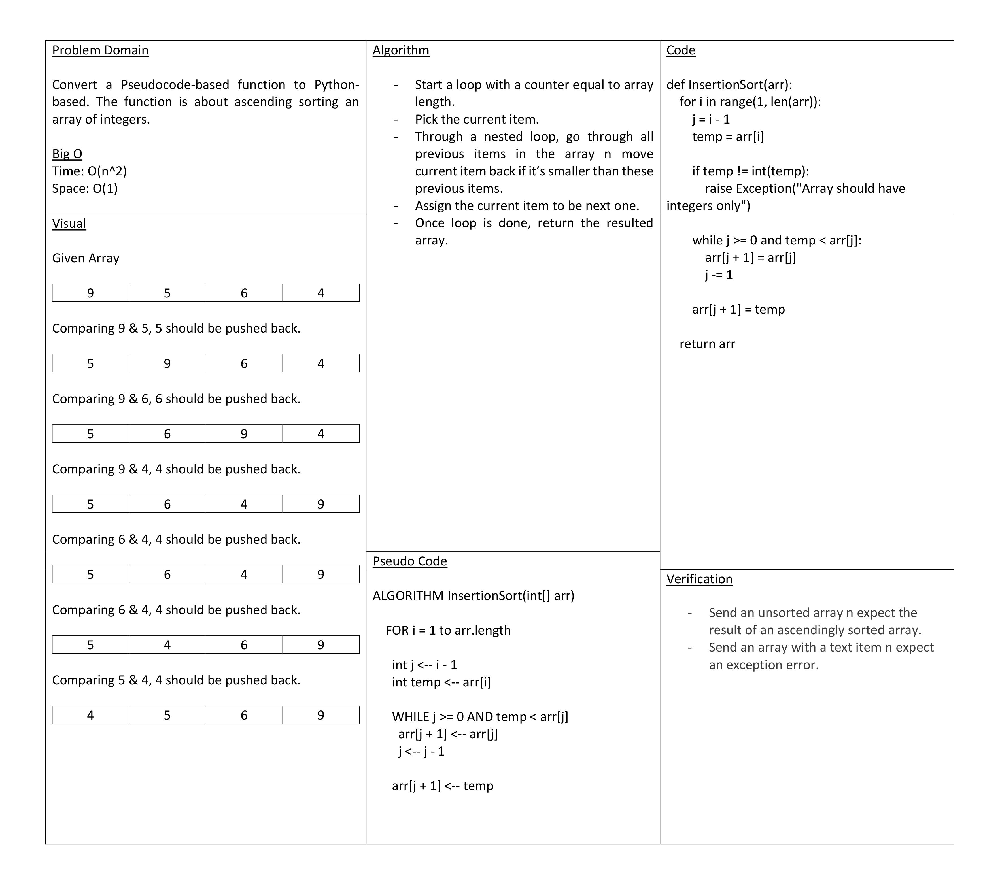

# Tree Max

To find the maximum node value of a binary tree

## Approach & Efficiency

- Check if the tree has a root. If not, return error msg.
- Check if tree node has no children. If so, return root node value.
- Initiate root value as maximum value.
- With a recursive approach, check if current node is bigger than maximum. If so, make its value the new max.
- Check if current got a left child or right child. If so, recursively send the child value into the same function.

Big O
Time: O(n)
Space: O(1)
