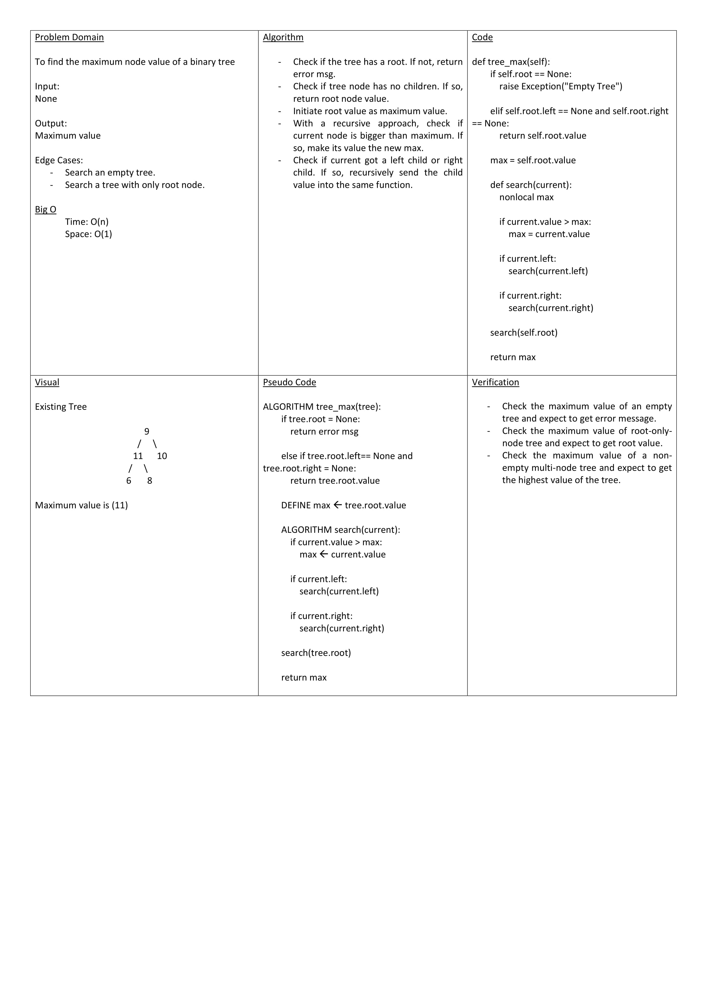

# Insertion Sort

Convert a Pseudocode-based function to Python-based. The function is about ascending sorting an array of integers.

## Whiteboard Process

## Approach & Efficiency

You may read all you need to know about used algo @ [project blog](./blog.md)
