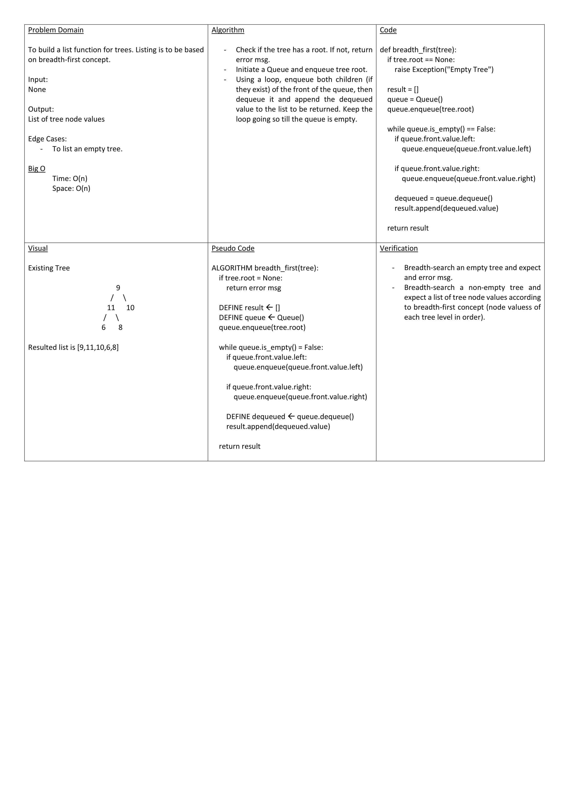

# Merge Sort

Convert a Pseudocode-based function to Python-based. The function is about ascending sorting an array of integers but using the merge apprach. Which is about splitting the array into nested halfs n compare elements between the splits before merging them back.

## Whiteboard Process

## Approach & Efficiency

You may check it @ [Project Blog](./blog.md)
