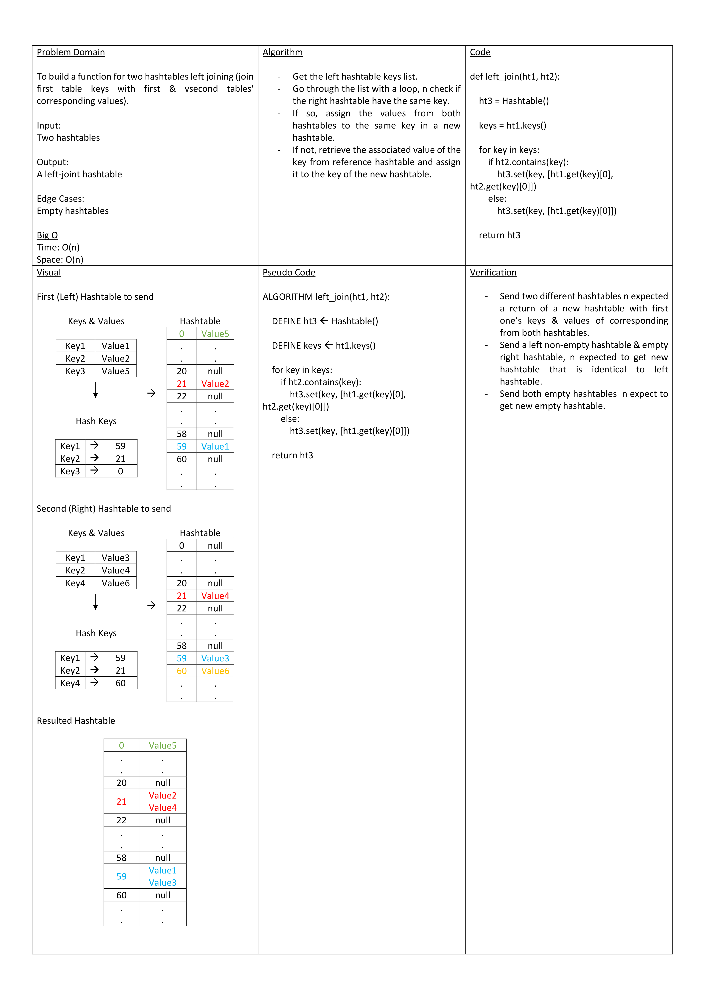

# Hashmap Left Join

Task is to build a function for two hash tables left joining (join first table keys with first & second tables' corresponding values).

## Whiteboard Process

## Approach & Efficiency

- Get the reference hashtable keys list
- Go through the list with a loop, n check if the other hashtable have the same key.
- If so, assign the values from both hashtables to the same key in a new hashtable.
- If not, retreieve the assoicated value of the key from reference hashtable and assign it to the key of the new hashtable.

Big O:
Time: O(n)
Space: O(n)

## Solution

    def left_join(ht1, ht2):
        ht3 = Hashtable()

        keys = ht1.keys()

        for key in keys:
            if ht2.contains(key):
                ht3.set(key, [ht1.get(key)[0], ht2.get(key)[0]])
            else:
                ht3.set(key, [ht1.get(key)[0]])

        return ht3
