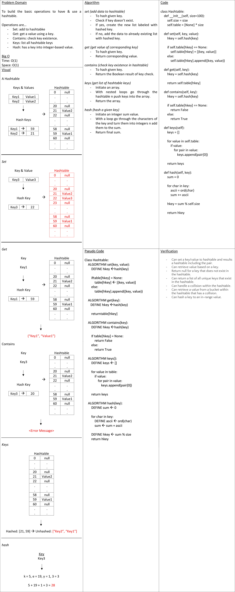

# Hashtable

Hashtable is the data structure where the address or the index value of the data item is generated from a hashing method. That makes accessing the data faster as the index value behaves as a key for the data value. In other words hashtable stores key-value pairs but the key is generated through a hashing / encrypting method.

In challenge at hand, it's required to build the basic operations to have & use a hashtable.

## Whiteboard Process

## Approach & Efficiency

A dedicated class was built with an initiator to have a size and a table to host the data. The class contains following methods.

### Big O

#### For Set Method

Time: O(n)
Space: O(n)

#### For Get Method

Time: O(1)
Space: O(1)

#### For Contains Method

Time: O(1)
Space: O(1)

#### For Keys Method

Time: O(1)
Space: O(1)

#### For Hash Method

Time: O(n)
Space: O(n)

## APIs

- set: to hash n insert data into the table.
- get: to get the value of a given key.
- contains: to check whether a key does exist in the table.
- keys: to list down the existing keys of the table.
- hash: to hash given key.
