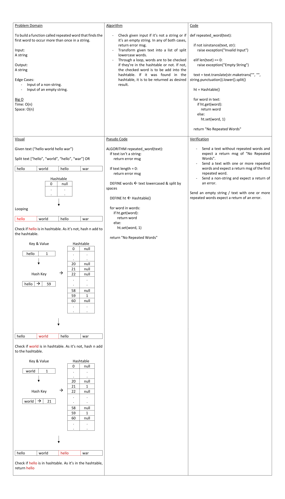

# Hashmap Repeated Word

To build a function called repeated word that finds the first word to occur more than once in a string.

## Whiteboard Process

## Approach & Efficiency

- Check given input if it’s not a string or if it’s an empty string. In any of both cases, return error msg.
- Transform given text into a list of split lowercase words.
- Through a loop, words are to be checked if they’re in the hashtable or not. If not, the checked word is to be add into the hashtable. If it was found in the hashtable, it is to be returned as desired result.

Big O:
Time: O(n)
Space: O(n)
