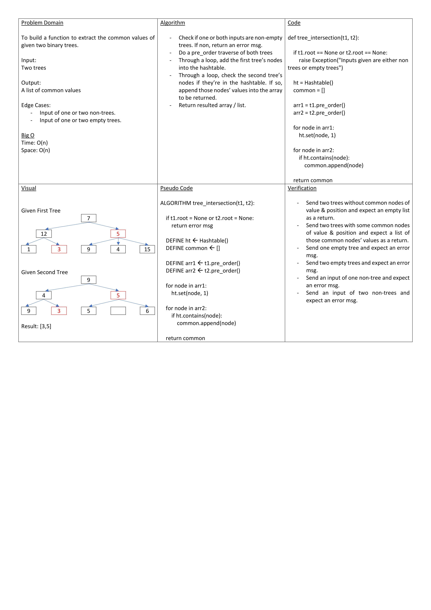

# Tree Intersection

To build a function to extract the common values of given two binary trees.

## Approach & Efficiency

- Check if one or both inputs are non-empty trees. If non, return an error msg.
- Do a pre_order traverse of both trees
- Through a loop, add the first tree’s nodes into the hashtable.
- Through a loop, check the second tree’s nodes if they’re in the hashtable. If so, append those nodes’ values into the array to be returned.
- Return resulted array / list.

Big O
Time: O(n)
Space: O(n)
