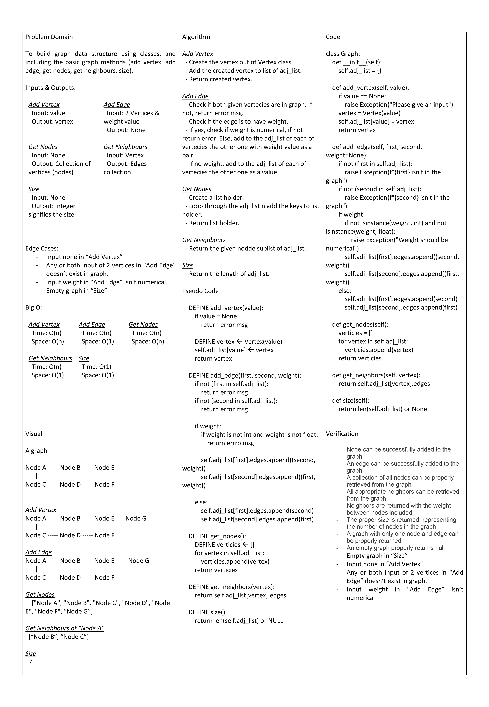

# Graph Implementation

To build graph data structure using classes, and including the basic graph methods.

## Whiteboard Process

## Approach & Efficiency

### Add Vertex

- Create the vertex out of Vertex class.
- Add the created vertex to list of adj_list.
- Return created vertex.

Big O:
  Time: O(n)
  Space: O(n)

### Add Edge

- Check if both given vertecies are in graph. If not, return error msg.
- Check if the edge is to have weight.
- If yes, check if weight is numerical, if not return error. Else, add to the adj_list of each of vertecies the other one with weight value as a pair.
- If no weight, add to the adj_list of each of vertecies the other one as a value.

Big O:
  Time: O(n)
  Space: O(1)

### Get Nodes

- Create a list holder.
- Loop through the adj_list n add the keys to list holder.
- Return list holder.

Big O:
  Time: O(n)
  Space: O(n)

### Get Neighbours

- Return the given nodde sublist of adj_list.

Big O:
  Time: O(n)
  Space: O(1)

### Size

- Return the length of adj_list.

Big O:
  Time: O(1)
  Space: O(1)
  