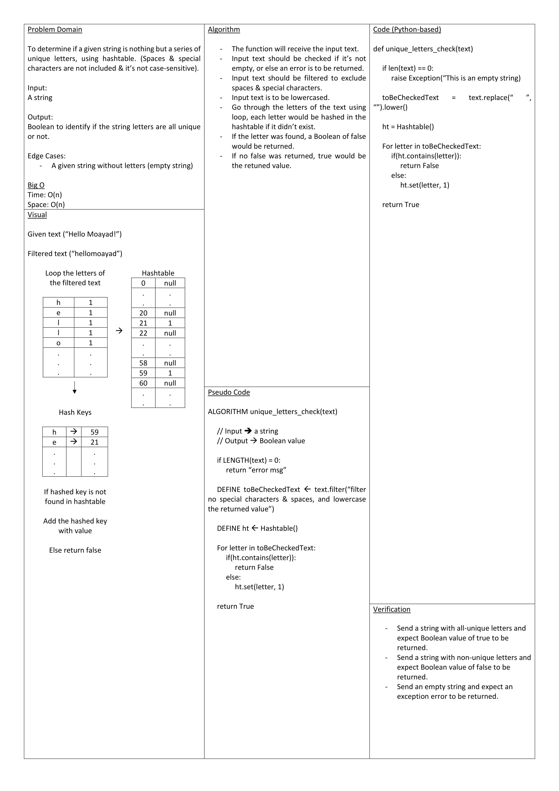

# Mock Interview

Interviewer: Moayad Abu Khadra
TimeStamp: 06:03pm - 06:25pm | Wednesday 1st Jun 2022

Problem: To determine if a given string is nothing but a series of unique letters, using hashtable. (Spaces & special characters are not included & it’s not case-sensitive).

[Assessment Sheet](./assessment.pdf)
