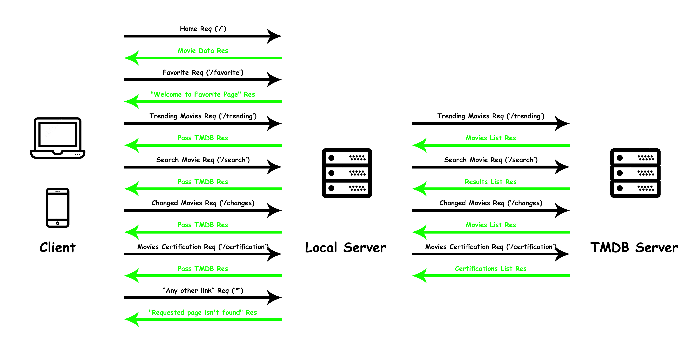

# Movies-Library - V5

**Author Name**: Suhaib Ahmad

## WRRC

This chart excludes PG admin Connections

## Overview

LTUC Day 14 Task

## Getting Started

* Clone this repo
* Cd to repo local directory
* Do "npm i" or "yarn"
* Do "npm start" or "yarn start"

## Project Features

* Includes serveral endpoints...
  * Without-Making-Any-Connection Endpoints ["/", "/favorite"]
  * TMDB-Connection Endpoints ["/trending", "/search", "/changes", "/certification"]
  * Local-DB-Connection Endpoints ["/addMovie", "/getMovies", "/getMovie/id", "/update/id", "/delete/id"]
* Handles "page not found" error
* Handles "internal server" error
