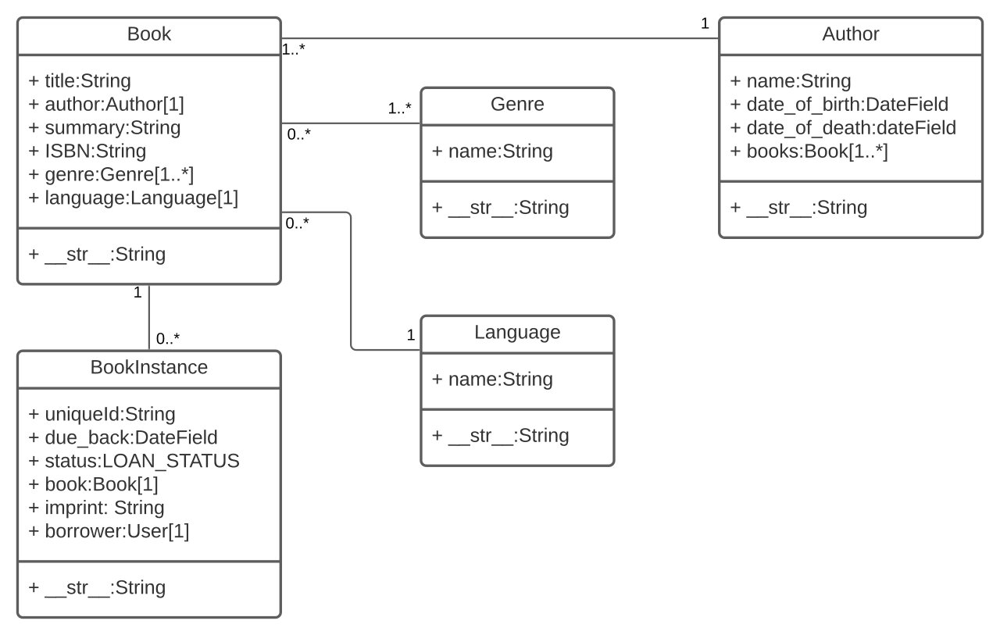

# Lesson 27 Reading

Navigation | [Past Reading](../Read-26/README.md) | [Home Page](../README.md) | [Next Reading](../Read-28/README.md) |

## Django Models

[Source](https://developer.mozilla.org/en-US/docs/Learn/Server-side/Django/Models)

Models in web apps are sort of the equivalent of classes in regular coding. Models are to initialize a structure for data objects to be generated and manipulated, but with a bit more features comparing to regular classes, like defining the type of data to be stored in a specific key, maximum length of data to be stored and relations with other models.

The best practice to build app models is to draft a DB-ERD, which is to contain all models structure (data key, type & features like uniqueness), and the relations between those models.

Once that diagram is built n finilized, models coding is next to build as follows...
from django.db import models
from django.urls import reverse

    class MyModelName(models.Model):

        my_field_name = models.CharField(max_length=20, help_text='Enter field documentation')

        class Meta:
            ordering = ['-my_field_name']

        def get_absolute_url(self):
            return reverse('model-detail-view', args=[str(self.id)])

        def __str__(self):
            return self.my_field_name

---

## Django Admin

[Source](https://developer.mozilla.org/en-US/docs/Learn/Server-side/Django/Admin_site)

Text
