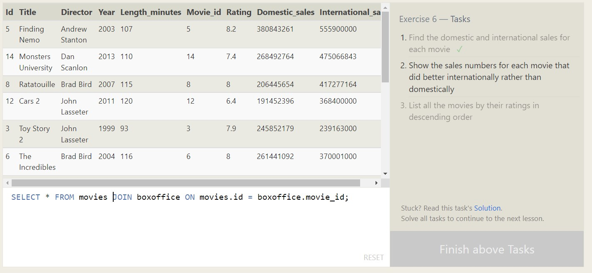

# SQL Summary

SQL is a language to manage databases with queries to insert, update, delete and retrieve (engagement options), and it's only possible to use with relational databases. It does contain a lot of queries / commands to facilitate the engagement with database to execute whatever is needed in the database without bothering to code many functions in the web app involved. For example, instead of calling all data of database n filter them in backend code, queries of where, if and such allows to call only necessary data filtered and ready for processing (viewing, updating ...etc) faster than calling n filtering all data in backend.

